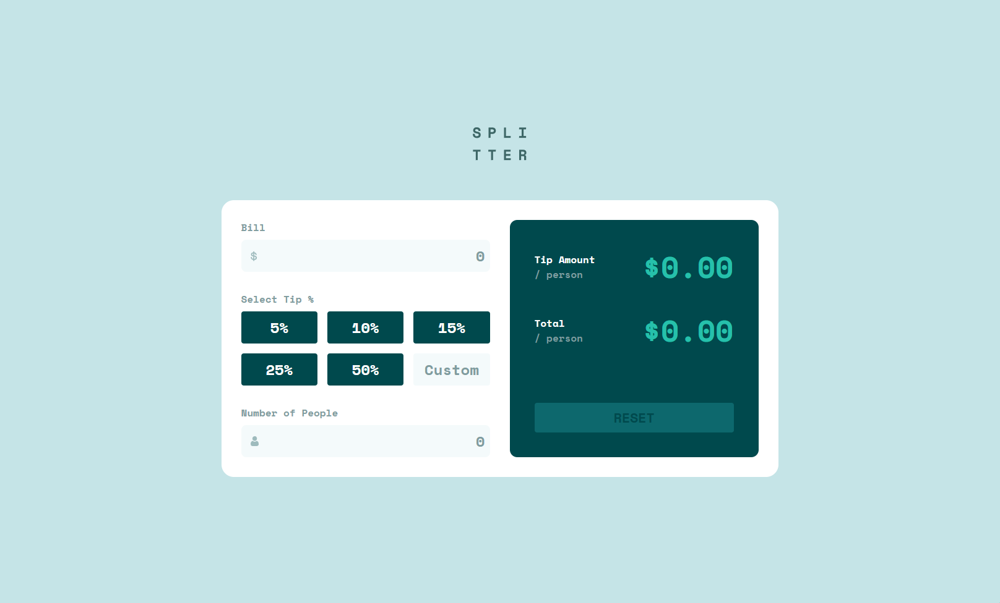

# 🌐 Frontend Mentor - Tip calculator app solution

This is my solution for the [Tip calculator app challenge on Frontend Mentor](https://www.frontendmentor.io/challenges/tip-calculator-app-ugJNGbJUX). Frontend Mentor challenges help you improve your coding skills by building realistic projects.

---

## 📋 Table of contents

- [Overview](#-overview)
  - [Features](#-features)
  - [Preview](#-preview)
  - [Links](#-links)
- [My process](#-my-process)
  - [Built with](#-built-with)
  - [What I learned](#-what-i-learned)
  - [Continued development](#-continued-development)
  - [Useful resources](#-useful-resources)
- [Author](#-author)
- [Acknowledgments](#-acknowledgments)

---

## 🌍 Overview

### ✨ Features

A responsive tip calculator app that allows users to:

- Enter a bill amount
- Select a predefined tip percentage or enter a custom value
- Specify the number of people splitting the bill
- Instantly calculate the tip amount per person
- Instantly calculate the total amount per person
- View hover states for interactive elements
- Experience an optimized layout across different screen sizes

---

### 🖼️ Preview



---

## 🛠️ My process

### 🧰 Built with

| Category  | Tools                     |
| --------- | ------------------------- |
| Structure | **Semantic HTML5 markup** |
| Styles    | **CSS (Flexbox & Grid)**  |
| Logic     | **JavaScript**            |

### 🧠 What I learned

While building this project, I:

- Improved my understanding of handling user input validation
- Strengthened my JavaScript logic for real-time calculations
- Practiced creating reusable functions for cleaner code
- Improved my responsive layout skills using Flexbox and Grid
- Learned how to manage UI state (active tip buttons, reset behavior, etc.)

Here are the parts of the tip calculation logic:

```js
const getTipAmount = () => {
  return ((billAmt * (tipPct / 100)) / peopleAmt).toFixed(2);
};

const getTotalAmount = () => {
  return ((billAmt * (1 + tipPct / 100)) / peopleAmt).toFixed(2);
};

const calculate = () => {
  if (!billAmt || !tipPct || !peopleAmt) return;

  tipAmtResult.textContent = `$${getTipAmount()}`;
  totalAmtResult.textContent = `$${getTotalAmount()}`;

  resetButton.disabled = false;
};
```

---

## 🚀 Continued development

In future projects, I want to focus more on:

- Writing more modular and reusable JavaScript
- Improving accessibility (ARIA attributes, better focus states)
- Enhancing form validation and error messaging
- Exploring small UI animations for better user experience

---

## 📖 Useful resources

- [MDN Web Docs](https://developer.mozilla.org/) – My go-to documentation for HTML, CSS, and JavaScript.
- [W3Schools](https://www.w3schools.com/) – Easy-to-follow tutorials and references for learning web development.

---

## 👨‍💻 Author

- GitHub - https://github.com/CrazyWizard04
- Frontend Mentor - https://www.frontendmentor.io/profile/crazywizard04

---

## 💖 Acknowledgments

A big thanks to **Frontend Mentor** for providing this challenge.
Their projects are a fantastic way to practice real-world frontend development skills and continuously improve as a developer.

Thank you <3
